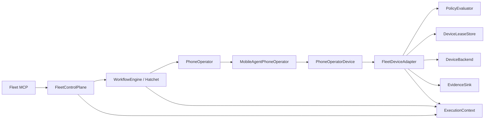

# Mobile-Agent Integration Graphify Report

Date: 2026-09-07

Scope: `E:\iphone-fleet-agent` local working tree

Tool: Graphify 0.9.55, `--code-only`, local AST extraction, no upload and no semantic LLM

Graph artifact: `.runtime/graphify-ma1/graphify-out/graph.json` (gitignored runtime evidence)

## Result

The post-integration graph contains **926 nodes, 1,663 edges and 62 communities**. Graphify reports **no import cycles**. `ExecutionContext` remains the highest-connectivity architectural node with 56 edges. Other relevant hubs include `FleetControlPlane` (22), `DeviceLeaseStore` (17), and `FleetDeviceAdapter` (15).

Verdict: **PASS WITH FINDINGS**. The intended governance boundary is visible and no Mobile-Agent/GUI-Owl type leakage or direct device bypass was found. Live Python/GUI-Owl and MobileNext/WDA behavior are outside this Windows graph result.

## Boundary checks

| Check | Result | Evidence |
|---|---|---|
| Mobile-Agent types absent from domain/contracts | PASS | No `MobileAgent` or GUI-Owl symbol match in `packages/domain` or `packages/contracts`; vendor-neutral `PhoneOperator` and `PhoneObservation` are defined there instead. |
| GUI-Owl types absent from Fleet MCP | PASS | No GUI-Owl symbol match in `apps/fleet-mcp`; the seven frozen tool declarations remain in `server.ts`. |
| Fleet MCP independent of Python/upstream internals | PASS | MCP depends on Control Plane; recorded MA1 composition is opt-in in `main.ts`. It imports neither the Python worker nor upstream source. |
| MobileAgentPhoneOperator does not own Registry | PASS | Graph node has dependencies on `MobileAgentRuntime` and `PhoneOperatorDevice`; no `RegistryReader` edge or source reference. |
| MobileAgentPhoneOperator does not own scheduler | PASS | No Hatchet, scheduler or queue dependency in `packages/mobile-agent-operator`. |
| Side effects pass through FleetDeviceAdapter | PASS | The only `backend.execute` call in the integration packages is `FleetDeviceAdapter.execute`; `MobileAgentPhoneOperator` calls its `PhoneOperatorDevice` dependency. A contract test also scans this boundary. |
| ExecutionContext remains governance core | PASS | It is Graphify god node #1 with 56 edges and is carried through MCP submission, Control Plane, Hatchet input, operator task, adapter, Evidence and Lease validation. |
| New dependency cycle | PASS | Graphify `GRAPH_REPORT.md`: `Import Cycles — None detected`. |

## Main paths observed



The mock composition also exposes an intentional local shortcut from Control Plane to a recorded PhoneOperator when no Hatchet engine is configured. Production composition selects the `WorkflowEngine` boundary; both routes converge on the same adapter and authorization contracts.

## Findings

- **MEDIUM:** Graphify proves static dependency shape, not that the Python process is the unmodified full upstream v3.5 loop or that GUI-Owl inference works. MA1 uses a recorded fixture and a thin JSONL protocol worker.
- **MEDIUM:** `MobileNextDeviceBackend` and WDA are future MA2 work; no graph path currently reaches a real iPhone.
- **LOW:** Code-only extraction excludes architecture Markdown and therefore does not validate prose-to-code consistency.
- **LOW:** Community names were intentionally left deterministic as `Community N` because `--no-label` avoided an external model call.

## Reproduction

```powershell
$env:PYTHONPATH=(Resolve-Path .runtime\graphify-tools).Path
py -m graphify extract . --code-only --force --out .runtime\graphify-ma1 --max-workers 4
py -m graphify cluster-only .runtime\graphify-ma1 --no-label
py -m graphify god-nodes --top 20 --graph .runtime\graphify-ma1\graphify-out\graph.json
```
