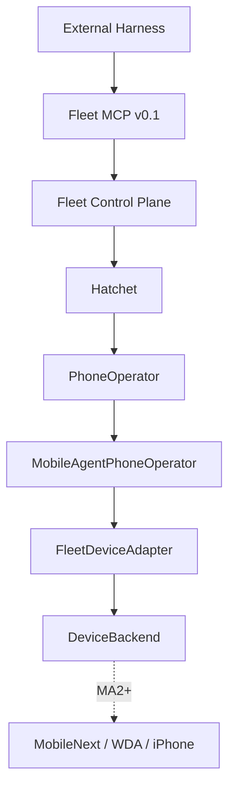

# PhoneOperator Runtime Architecture

## Ownership

Fleet/Hatchet own many devices. Each `PhoneOperator` session owns only the current task context for one already-assigned device. GUI-Owl proposes actions; it is never a safety or success authority.

## Runtime contracts

- `PhoneOperatorTask`: exact `ExecutionContext`, instruction, limits, policy profile, verification and metadata.
- `PhoneOperatorResult`: execution result (`SUCCEEDED`, `FAILED`, `HUMAN_REQUIRED`, `CANCELLED`, `TIMED_OUT`), completion proposal, counts, Evidence references and typed failure.
- `PhoneObservation`: screenshot reference, dimensions, foreground app and timestamp from Fleet's `DeviceBackend`.
- `FleetDeviceAdapter`: validates registry identity and active lease/fencing on observation and again before every side effect; then applies Policy and calls the backend.
- `MobileAgentRuntime`: internal action-proposal boundary implemented by a recorded fixture or a supervised Python JSONL worker.

## Session isolation

The safe default is one active worker/session per device. A worker frame contains only the bound ExecutionContext and current observation; there is no device list, account list, network inventory or routing command. One in-flight request provides backpressure. Cancellation aborts pending model work and is checked again immediately before a device action to prevent late taps.

## Recovery split

Mobile-Agent may recover from GUI-level no-change/wrong-page/action failures within `maxSteps`, timeout and consecutive-failure limits. Fleet/Hatchet handle device offline, stale leases, worker crash, durable retries and Human Gate. Completion is only a proposal until Fleet verification and Evidence succeed.

## Future deterministic seam

Unknown/dynamic work uses Mobile-Agent. Successful stable trajectories may later be compiled and replayed through OpenAdapt + Mobilewright. MA1 records this seam only and does not couple both runtimes.
