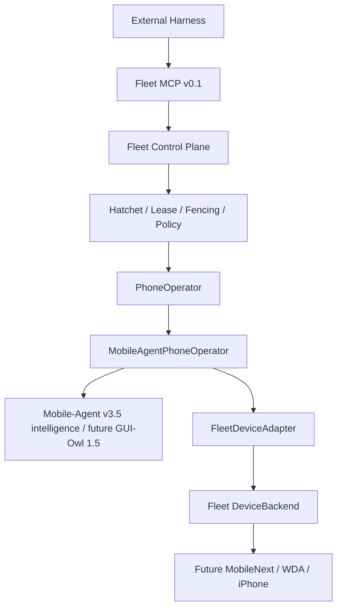

# MA1 Mobile-Agent Phone Operator Integration Report

## Executive Verdict

**MOBILE_AGENT_OPERATOR_READY_FOR_MAC_POC_WITH_FINDINGS**

MA1 establishes and verifies the Fleet-owned, single-device PhoneOperator architecture through a recorded model fixture. The full mock path reaches `Fleet MCP → Fleet Control Plane → Hatchet → MobileAgentPhoneOperator → FleetDeviceAdapter → MockDeviceBackend → verification → Evidence`. It does not prove upstream iOS support, live GUI-Owl inference, MobileNext/WDA compatibility, or production scale.

License hard gate: **PRODUCTION_LICENSE_GATE_PASS** for the pinned code and model artifacts reviewed. This is an engineering finding, not deployment legal advice.

## Baseline

- Branch: `feat/mobile-agent-phone-operator`
- Initial HEAD: `a11d0e7c6f96b30e66848edb5395823d99369dad`
- Frozen MCP checkpoint: `04856398838d6af1b89ddebfcfbc80afd463dc65`
- Annotated freeze tag: `fleet-mcp-v0.1-freeze`
- Frozen external contract: the existing seven tools and their success/error semantics were not renamed, deleted, or extended with Mobile-Agent/GUI-Owl/private device types.

## Upstream

- Mobile-Agent repo: `https://github.com/X-PLUG/MobileAgent.git`
- Path/ref/SHA: `Mobile-Agent-v3.5`, `main`, `11cea575561fb7800b5fb6b6cafa56f7a91de11f`
- Mobile-Agent license: MIT at repository root; bundled AndroidWorld subtree carries Apache-2.0 material and notices.
- GUI-Owl candidate: `mPLUG/GUI-Owl-1.5-8B-Instruct`
- Model revision: `06d5faecff74840bab2be2425e9c42667a5d04fc`
- Model card license: MIT; declared base family Qwen3-VL, whose official model card is Apache-2.0.
- Terms finding: no research-only, educational-only, non-commercial, group-control, multi-device or multi-account field-of-use restriction was found in the reviewed official artifacts. A future hosted inference provider can add separate terms.
- Weights downloaded: no. Live endpoint used: no. **LIVE_MODEL_NOT_TESTED.**
- Pin manifest: `vendor/upstream-lock.json`; upstream checkout is gitignored and unmodified.

The pinned v3.5 README explicitly says its current device-tool debugging supports Android only and not iOS. Its phone runner owns ADB, screenshots and input directly; those components are excluded from the Fleet integration path.

## Architecture

Fleet owns device/account/network selection, ExecutionContext, Registry, Lease, fencing, Policy, Job lifecycle, scheduling, concurrency, Evidence authority and Human Gate. Mobile-Agent owns only the reasoning loop for one already-bound device. DeviceBackend owns observation and side effects. GUI-Owl owns inference.

## PhoneOperator Contract

The application layer now exposes vendor-neutral `PhoneOperator`, `PhoneOperatorTask`, `PhoneOperatorResult` and `PhoneOperatorDevice` contracts. A task binds one complete `ExecutionContext`, instruction, hard limits, policy profile, verification, workflow revision and metadata. Results express `SUCCEEDED`, `FAILED`, `HUMAN_REQUIRED`, `CANCELLED` or `TIMED_OUT`, with bounded metrics, Evidence references and normalized failure data. It does not duplicate the durable Job state machine.

## Mobile-Agent Integration

- KEEP: per-device planning/execution reasoning, reflection concepts, progress/history, bounded recent observations, GUI grounding/model invocation and completion proposal.
- ADAPT: action schema, normalized 0–1000 coordinates, model configuration, short-term history and completion into Fleet-neutral runtime types.
- REPLACE: ADB, Android discovery, Android screenshots, Android input/app launch, AndroidWorld environment and device ownership with `FleetDeviceAdapter`/`DeviceBackend`.
- DO_NOT_USE: fleet discovery, device choice/switching, account/network routing, custom scheduling, direct ADB/WDA fallback, Android package management and any multi-device global Agent state.

MA1 uses a standard-library Python JSONL worker and a recorded runtime to prove the internal process protocol. It does not claim to execute the complete upstream Python planner/model loop. The exact component and action extraction is in `docs/oss/mobile-agent-v35-integration-map.md`.

## Device Observation Path

`MobileAgentPhoneOperator → PhoneOperatorDevice.observe → FleetDeviceAdapter → DeviceBackend.observe` returns vendor-neutral `PhoneObservation`: screenshot reference, dimensions, foreground app and timestamp, with optional elements only when a backend supplies them. The observation path validates the exact device/account/network binding and active Lease.

## Device Action Path

The enforced order is `model proposal → normalization → Fleet Policy → Lease/fencing validation → DeviceBackend action → Evidence`. The pinned vocabulary maps click, long press, type, swipe/scroll, open, supported system buttons, wait, completion and human interaction. Unknown actions, the declared-but-unimplemented upstream `key`, and unsupported buttons fail closed with `UNSUPPORTED_OPERATOR_ACTION`. There is no ADB or WDA fallback.

## Lease / Fencing

Each invocation is bound to one device, Lease ID and fencing token. `FleetDeviceAdapter` rechecks complete binding, policy and Lease/fencing before every side effect. The regression suite makes the token stale after successful steps and proves the next proposed action and all later actions produce no backend side effect.

## Policy

Mobile-Agent is a planner, never the authority. The MA1 safe profile allows narrow navigation and gates taps, long presses and text input for human review. Unknown or sensitive external actions are denied. Publishing, likes, follows, comments, messages, profile/security changes, deletion, purchase/payment, recovery and credential export are never auto-approved.

## Human Gate

Login, 2FA, captcha, challenge, manual confirmation and sensitive action requests produce `HUMAN_REQUIRED`. Hatchet persists a scoped `fleet:human-resume` wait. The integration test stops the operator Worker during the wait, starts a replacement, resumes by Job scope, and reruns the PhoneOperator so it obtains a new observation rather than retaining an old screenshot.

No captcha/2FA bypass, stealth, fingerprint spoofing, jailbreak or fake-human behavior is implemented.

## Hatchet

`FleetControlPlane` has a formal `WorkflowEngine` dependency for PhoneOperator jobs. `fleet-phone-operator-ma1` uses `deviceId` as the concurrency key, a fixed maximum of one run per device, pinned WSL Worker labels and Hatchet retry. The embedded integration verified:

- full recorded-model mock vertical slice: `SUCCEEDED`;
- same-device maximum active workflows: 1;
- different-device maximum active workflows: 2;
- retry attempts: 0 and 1;
- PhoneOperator human wait: resumed after Worker restart.

The local recorded fixture remains opt-in for MCP black-box testing; default H0 mock behavior is unchanged.

## Process Isolation

The selected private boundary is deterministic versioned JSONL over child-process stdio. It carries request ID, correlation and bound ExecutionContext; enforces one in-flight request for backpressure; separates stderr; handles timeout, cancellation, health and crash; and redacts diagnostic values. The Python worker binds one active session to one device and rejects switching. The safe default deployment model is one active operator process/session per device, providing device affinity and crash/cancellation isolation.

## Evidence

Each adapter step records ExecutionContext, operator identity/SHA, model identity, step/timestamp, observation ref, redacted proposal summary, normalized action, policy and Lease/fencing results, backend result, verification, latency and token usage when supplied. Passwords, tokens, raw secret text and hidden chain-of-thought are not stored. Mobile-Agent completion is only a proposal; Fleet verification is required before success.

## Recovery

The error taxonomy covers observation/action/backend failures, offline devices, Lease expiry/stale fencing, policy/human decisions, model error/timeout, process crash, step/task limits, verification and unsupported actions. Mobile-Agent may recover only from GUI/task-level action failures within its budget; Fleet/Hatchet owns process/device/workflow recovery and retry.

## Cancellation

The operator checks cancellation before observation/model work and again after model inference before normalization/action. The late-tap regression cancels between observation and action and proves no action executes. The JSONL bridge kills an aborted child request. Production mapping from an external Hatchet cancellation event into the child `AbortSignal` remains a finding for MA2 hardening.

## Context / Memory

MA1 keeps per-session history, observation references, failure outcomes and upstream-compatible action context. It measures step, screenshot, model-call and token counts, and enforces `maxSteps`, task timeout and maximum consecutive failures. It adds no vector database, long-term memory framework, GELab integration or model router.

## Mock Vertical Slice

The tested path is:

`Fleet MCP → FleetControlPlane → embedded Hatchet WorkflowEngine → MobileAgentPhoneOperator → RECORDED_MODEL_FIXTURE → FleetDeviceAdapter → MockDeviceBackend → Fleet verification → Evidence → terminal state → Lease release`.

The MCP black-box suite also confirms all seven frozen tools remain present while an opt-in recorded operator completes a task. No fake model result is described as GUI-Owl.

## Test Results

Final Windows/WSL verification result: **PASS**.

| Suite | Result |
|---|---:|
| Build / typecheck / Biome | PASS |
| Unit | 2 files, 5 tests PASS |
| Contract | 10 files, 48 tests PASS |
| Fleet MCP stdio black-box | 1 file, 2 tests PASS |
| Local integration, including real Python JSONL fixture | 4 files, 7 tests PASS |
| E2E mock | 2 files, 9 tests PASS |
| PostgreSQL Registry/Lease | 1 file, 7 tests PASS |
| Hatchet embedded | PASS; concurrency, retry, full MA1 mock path, durable human resume and Worker restart |
| OpenAdapt synthetic A6 regression | PASS, `COMPLETED_UNVERIFIED`, zero model calls |
| `git diff --check` | PASS |

No `skip`, `todo` or `only` test marker was found.

## Graphify Post-Audit

Local-only Graphify 0.9.55 scanned 120 code files and produced 926 nodes, 1,663 edges and 62 communities. It found no import cycle. `ExecutionContext` remains god node #1 with 56 edges. Static and contract checks found no Mobile-Agent type in domain/contracts, no GUI-Owl/private device type in MCP, no Registry/scheduler owned by `MobileAgentPhoneOperator`, and no side-effect route around `FleetDeviceAdapter`. See `docs/architecture/MOBILE_AGENT_INTEGRATION_GRAPHIFY_REPORT.md`.

## Mac / iOS Status

**REAL IOS = NOT TESTED**

`MobileNextDeviceBackend` is not implemented or validated. macOS, Xcode signing, pairing, WDA, MobileNext/mobilecli, explicit-UDID probes and reconnect behavior remain for Owner-approved MA2. The new doctor contract can report only `BLOCKED` or `READY_FOR_HUMAN_GATES`, never iOS PASS. See `docs/poc/mobile-agent-mac-handoff.md`.

## Multi-iPhone Status

- 1 real iPhone = **NOT TESTED**
- 2 real iPhones = **NOT TESTED**
- 4 real iPhones = **NOT TESTED**
- 6 real iPhones = **NOT TESTED**
- 9 real iPhones = **NOT TESTED**

The planned gates are MA2=1, MA3=2, MA4=4, MA5=6 and MA6=9. Each level must measure success, wrong-device action, disconnect/WDA/process failures, recovery, latency, steps/model calls/tokens, resource/API throughput, USB errors, queue delay and Evidence completeness; instability stops scaling.

## Findings

### CRITICAL

- None identified in the MA1 mock scope.

### HIGH

- Upstream Mobile-Agent-v3.5 officially does not support iOS in its current device tool; MobileNext/WDA compatibility is unproven.
- GUI-Owl weights were not downloaded and no live inference endpoint was tested: `LIVE_MODEL_NOT_TESTED`.
- A long durable human wait can outlive the Control Plane-acquired Lease. MA2 must define renewal or release/reacquire and rebuild the ExecutionContext before resumed real-device work; the adapter correctly rejects an expired/stale context.

### MEDIUM

- The Python worker is a protocol/recorded-fixture implementation, not the full pinned upstream planner/reflector/model runtime. Live-mode dependency pinning and injection must be evaluated before activation.
- End-to-end propagation of Hatchet/external cancellation into the running Python child requires production composition work, although operator and bridge cancellation contracts are tested independently.
- Current per-process identity is safe by construction but operational supervision, resource ceilings and endpoint capacity have not been measured on macOS.

### LOW

- Embedded Hatchet emits transient authentication and shutdown-listener noise during local startup/teardown even though the asserted run succeeds.
- OpenAdapt's existing synthetic report warns that the optional PHI scrubber is absent; production Evidence/privacy policy must remain fail-closed before human data is used.
- Graphify code-only mode excludes Markdown and leaves communities unlabeled to avoid external model calls.

## Technical Debt

- Implement and contract-test `MobileNextDeviceBackend` on the dedicated Mac lab with explicit UDID.
- Add a fully pinned Python live-model environment and secret-provider configuration for self-hosted vLLM/SGLang/OpenAI-compatible inference.
- Resolve Lease lifecycle across durable waits and wire Hatchet cancellation through the Worker to the JSONL child.
- Add production process supervision, resource quotas, observability export and model capacity tests.
- Retain OpenAdapt as a separate future compile/replay seam for mature flows; do not merge it into the dynamic operator loop in MA1/MA2.

## Upstream Patch Burden

**Does Fleet need to fork Mobile-Agent? No, not for MA1; target remains `NO LONG-TERM FORK`.**

Current upstream patch size is zero. Fleet uses an unmodified gitignored pinned checkout and owns an external runtime/adapter boundary. The preferred live integration is to inject/import model and Agent intelligence without instantiating ADB. If the upstream code cannot expose that seam without modifying core/global state, stop and repeat OSS Evaluation before choosing a small maintained patch stack. Any future patches must remain isolated, documented against the exact SHA, tested on upgrade, and proposed upstream where generally useful.

## Git

- Branch: `feat/mobile-agent-phone-operator`
- HEAD: local commit `feat: integrate mobile-agent phone operator runtime` (exact SHA reported after commit)
- Expected final status: clean
- Remote: none configured; unchanged; nothing pushed
- Tags: local annotated `fleet-mcp-v0.1-freeze`; no release tag added

## Final Verdict

**MOBILE_AGENT_OPERATOR_READY_FOR_MAC_POC_WITH_FINDINGS**

The architecture meets the MA1 goal: Fleet/Hatchet governs many devices while each isolated PhoneOperator sees only one bound device, and every side effect remains under Fleet Policy, Lease/fencing and Evidence control. Owner review is required before MA2. This report does not authorize or begin a Mac/iPhone test.
